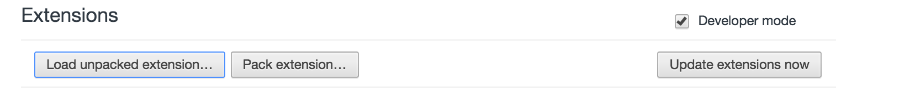

# noFacebook
## 
## Description
Facebook being the most important distraction for the people concentrating on anything, :sweat_smile:
and the reason for this is its user interface, which everytime happens to keep you bounded with it and leading you spend a lot of time on it.

The solution for this seems to be
***https://m.facebook.com/***

This chrome extension will land you up to the mobile version of facebook.

## How to install this extension

To download the package

```
git clone https://github.com/gadabout-geek/noFacebook.git
```

After this open your Google-Chrome browser and visit to
`chrome://extensions`

Make sure you enable the Developer mode


To load the unpacked extension click on Load Unpacked Extension Button



Browse noFacebook folder and select.

**Voila!** now you can concentrate *without enjoying facebook much* :smile:
